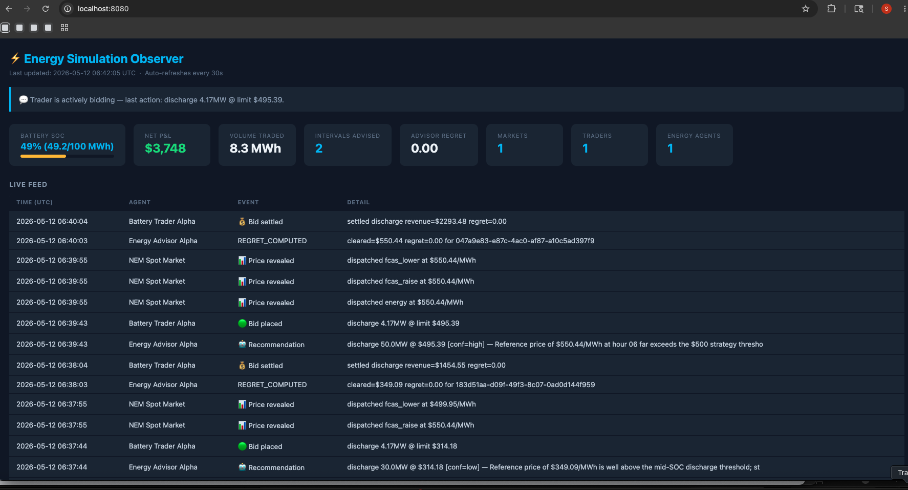

# Energy Market Simulation

A distributed multi-agent simulation of an electricity market, built to explore how AI-driven advisors can improve battery trading decisions in real-time.

The simulation models three real-world roles — a **Market** that generates price signals, a **Trader** that manages a battery asset, and an **Energy Agent** that acts as an intelligent advisor — all communicating over HTTP the way real autonomous agents would.

---

## What it simulates

Batteries in electricity markets make money by buying cheap (charging during off-peak hours) and selling high (discharging during price spikes). The hard part is knowing *when* prices will spike — and how much to bid.

This simulation pits an AI advisor against that problem in real time:

1. The **Market** generates realistic price intervals drawn from real Australian NEM data, opening bid windows every few minutes.
2. The **Trader** manages a 100MWh battery with hard physical constraints (SOC limits, charge/discharge rates). Before each interval it asks the Energy Agent for a recommendation.
3. The **Energy Agent** runs an investigation pipeline — querying market history, checking its learned strategy rules, finding similar past intervals — then recommends a direction (charge/discharge), volume, and limit price with a confidence score.
4. A **hard gate** ensures every recommendation is grounded in tool evidence. An ungrounded recommendation returns `direction=none` rather than risk a bad bid.
5. A **soft gate** (second LLM acting as judge) scores recommendation quality and downgrades confidence if low. The Trader scales volume down on low-confidence recommendations.
6. After each interval dispatches, the Energy Agent computes **regret** — how much revenue was left on the table vs. perfect foresight — and stores it in its learning ledger.
7. Every 100 intervals, an **adaptation loop** distills the ledger into updated strategy rules. Every 200 intervals, a **tool synthesis loop** generates new analysis functions targeting unexplained regret patterns.

Multiple Energy Agents can run simultaneously (different strategies, different people) and compete — the Trader migrates toward the best-performing advisor.

---

## Architecture

```
Registry :8000  — agent directory, heartbeat, discovery
Market   :8001  — price intervals, bid windows, dispatch
Trader   :8002  — battery SOC, bidding loop, P&L tracking
Energy   :8003  — recommendation pipeline, learning loop
Observer :8080  — dashboard, rankings, cross-validation
```

```
         Trader ──GET /recommend──► Energy Agent
           │                            │
           │ POST /bids                 │ polls cleared prices
           ▼                            ▼
         Market ◄────────────────── Market
           │
           └── Observer polls all agents every 30s → dashboard
```

---

## Dashboard



The screenshot above was captured roughly 20 minutes into a run using real Australian NEM price data from 26 January 2026 — a day with an extreme evening price spike.

**What you're looking at:**

- **$3,748 net P&L / 8.3 MWh traded.** The battery has discharged profitably into the evening price spike. Revenue starts near zero (or negative, while charging is paid for) and climbs as dispatched intervals are settled.

- **Evening price spike — $8,929/MWh.** The Live Feed shows a `Price revealed` event at $8,929/MWh. This is a real NEM price from that date — a demand-driven spike where the market briefly cleared at nearly 9× the normal cap. The battery discharged into this interval, which is where most of the P&L was earned.

- **`RECENT_COMPUTED` events in the Live Feed.** These are the Energy Agent's learning loop firing — it detected a cluster of high-regret intervals and recomputed its strategy context. The updated rules get injected into every subsequent recommendation prompt.

- **`Bid passed` → `Recommendation` → `Bid settled` cycle.** This is the normal per-interval flow: Energy Agent recommends, Trader bids, Market dispatches, outcome settles. You can trace a full cycle in the feed.

- **`Advisor Regret: 0.00`.** By the time of this screenshot the agent's recommendations aligned closely with what perfect foresight would have chosen — regret has converged toward zero on the price spike intervals it has seen before.

- **Agents Online: 1 Market · 1 Trader · 1 Energy Agent.** All three core agents are healthy and registered with the Registry. The Observer is cross-validating Energy Agent self-reported metrics against actual Trader outcomes in the background.

---

## Quick start

```bash
# 1. Install dependencies
pip install -r requirements.txt

# 2. Add your Anthropic API key
cp .env.sample .env
# edit .env and paste your key: ANTHROPIC_API_KEY=sk-ant-...

# 3. Start everything
./start.sh
```

Open **http://localhost:8080** — the dashboard auto-refreshes every 30 seconds.

To stop: `./stop.sh`

---

## What you're watching

**Battery SOC** — state of charge as a percentage. The strategy targets charging when prices are low, discharging at peaks. SOC rising = charging. SOC falling = discharging.

**Net P&L** — cumulative revenue. Starts negative (charging costs money), turns positive as the battery discharges at higher prices. The goal is to beat a naive always-discharge strategy.

**Advisor Regret** — the key metric. Measures how much revenue the Energy Agent's recommendations left on the table vs. perfect foresight. Lower is better. Decreases as the agent learns.

**Live Feed** — real-time stream of what every agent is doing: bids placed, prices revealed, recommendations made, strategy updated.

**Learning Generation** — how many adaptation loops the Energy Agent has completed. Higher = more learned strategy rules incorporated into recommendations.

---

## Running multiple advisors (competition mode)

```bash
# Start a second Energy Agent with a different strategy
ENERGY_PORT=8004 ENERGY_NAME="FCAS Specialist" python -m energy.agent
```

Both register with the shared Registry. The Trader discovers both and tracks their regret separately, migrating to whichever performs better. The Observer leaderboard shows both side by side.

---

## How the Energy Agent learns

The agent improves through four layers, each building on the previous:

**Layer 1 — Experience accumulation.** Every recommendation is stored with its outcome. After each interval dispatches, the agent fetches the cleared price, computes regret, and records it. From interval one it is building a ground-truth log of what worked and what didn't.

**Layer 2 — Retrieval.** Before recommending, the agent searches its history for past intervals with similar conditions (same hour, similar SOC, similar price trend). It uses those as concrete examples: "last time conditions looked like this, I recommended charge and regret was near zero." More history = better matches.

**Layer 3 — Strategy distillation (every 100 intervals).** A background loop reads the ledger, finds high-regret clusters, and rewrites a `strategy_context.md` file with updated rules — e.g. "avoid large discharge volumes before 9am regardless of reference price." These rules are injected into every future recommendation prompt.

**Layer 4 — Tool synthesis (every 200 intervals).** If regret clusters remain unexplained by existing analysis tools, the agent generates new Python analysis functions targeting that specific pattern, backtests them, and registers them permanently if they help.

**What this is — and isn't.** The agent gets better at *deciding what to do* in a given situation. It does not forecast future prices. It never models "the price at 6pm will be $180." It reasons over historical similarity and learned rules. That distinction matters: if tomorrow's market behaves in a way that never appeared in historical data, the agent has no signal to retrieve from. A price forecasting model — trained on rolling market data, producing a probability distribution over future prices — would be the next meaningful layer on top of this. That is left as a deliberate gap and an obvious extension.

---

## Key design decisions

**Regret over revenue** — the Energy Agent is scored on its own advice, not on whether the Trader followed it. This separates recommendation quality from execution.

**Hard gate before soft gate** — a mechanical check (did the recommendation cite actual tool evidence?) runs before any LLM judge. An ungrounded recommendation never reaches the Trader.

**No cryptography** — this is a cooperative simulation. Agents trust each other. The Observer cross-validates self-reported metrics against actual trader outcomes to flag discrepancies.

**Brain is the only thing to subclass** — every agent has a `Brain` class that encapsulates its intelligence. The Market Brain generates price scenarios. The Trader Brain decides bid size and selects which Energy Agent to trust. The Energy Agent Brain runs the full investigation and recommendation pipeline. All background loops, HTTP plumbing, heartbeats, and quality gates are shared infrastructure that any Brain plugs into. To build a competing advisor with a different strategy or model, subclass `energy.brain.Brain` and override `recommend()` — nothing else needs to change.
